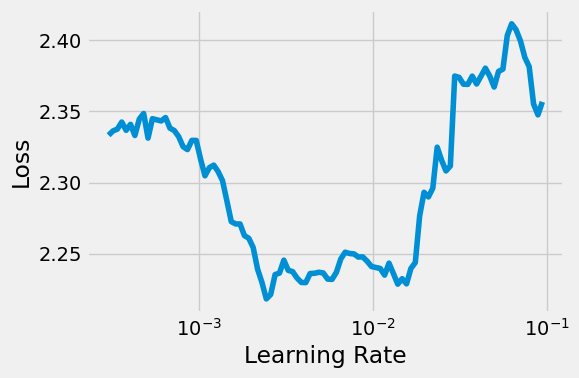
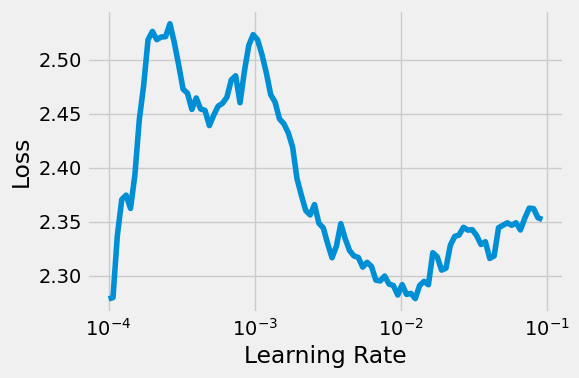

## 🧠 Model Details

This multi-class image classification model (v1) was developed by **Ian Antonio Fonseca de Araújo** and **João Vítor de Souza Lopes**, students at **UFRN**, and finalized in **July 2025**. It implements a **Convolutional Neural Network (CNN)** trained with the **Adam optimizer** using the **PyTorch** framework.

The model classifies animal images into 10 categories based on their visual features. Input images were resized to 128×128 pixels and normalized. Multiple CNN architectures were evaluated, varying in depth, number of filters (n_feature), and padding to assess their impact on performance.

Three models were developed during experimentation. All were trained for 5 epochs, and the learning rate was selected using a learning rate finder to ensure stable convergence and efficient training.

---

### 🔹 1st Model

* **Convolutional layers:** 2 (with `padding = 0`), `n_feature = 5`
* **MaxPooling:** Applied after each convolution (kernel size = 2)
* **Fully connected layer:** 4,500 → 10
* **Regularization:** Dropout (`p = 0.3`) included

---

### 🔹 2nd Model

* **Convolutional layers:** 2 (with `padding = 1`), `n_feature = 11`
* **MaxPooling:** Applied after each convolution (kernel size = 2)
* **Fully connected layer:** 22,528 → 10
* **Regularization:** Dropout (`p = 0.3`) included

---

### 🔹 3rd Model (Final)

* **Convolutional layers:** 4 (with `padding = 1`), `n_feature = 32`
* **MaxPooling:** Applied after every two convolutional layers (kernel size = 2)
* **Fully connected layer:** 16,384 → 10
* **Regularization:** Dropout (`p = 0.3`) included

---

### 🔹 Transfer Learning Model (based on ResNet18)

This model uses the **ResNet18** architecture pre-trained on **ImageNet** as a feature extractor. The final fully connected layer was replaced to output predictions for **10 animal classes**. 

* **Backbone:** Pretrained ResNet18
* **Final Layer:** Modified fully connected layer for 10-class output

---

Complete code and training history are available in the [GitHub repository](https://github.com/Onifin/PPGEEC2318/tree/main). For questions or issues, please open an issue in the repository.

---

## 🎯 Intended Use

The model was developed for **educational purposes**, specifically for the course **PPGEEC2318 - Aprendizado de Máquina** at UFRN.

**Intended users:**

* Graduate students
* Researchers exploring CNNs in image classification
* Educators demonstrating practical applications of deep learning in computer vision

---

## 📈 Factors

The dataset consists of natural animal images collected from Google Images, organized into 10 categories: dog, cat, horse, spider, butterfly, chicken, sheep, cow, squirrel, and elephant.

---

## 📊 Metrics

The model’s performance was evaluated using:

* **Accuracy:** proportion of correct predictions over all predictions
* **Confusion Matrix:** shows the correct and incorrect predictions per class
* **Loss Function:** CrossEntropyLoss

---

## 📁 Evaluation Data

### **Dataset**

* Source: [Animals-10 Dataset on Kaggle](https://www.kaggle.com/datasets/alessiocorrado99/animals10)
* Total images: **26179**
* Classes: Dog, Cat, Horse, Spider, Butterfly, Chicken, Sheep, Cow, Squirrel, Elephant
* Verified and labeled by humans

### **Split**

* **80% training:** 20,938 images
* **20% testing:** 5,241 images
* Each class was split individually to maintain proportional representation

### **Preprocessing**

* Resize to 128×128 pixels
* Normalization using torchvision transforms
* Conversion to tensor and application of data augmentation (`composer`) during training

---

## 🧪 Training Data

Below is the class distribution used for training (after 80/20 split):

| Class     | Training Samples |
| --------- | ---------------- |
| Cavalo    | 2,098            |
| Ovelha    | 1,456            |
| Elefante  | 1,156            |
| Gato      | 1,334            |
| Esquilo   | 1,489            |
| Galinha   | 2,478            |
| Aranha    | 3,856            |
| Gado      | 1,492            |
| Cachorro  | 3,890            |
| Borboleta | 1,689            |

All images were resized and normalized. No missing data or imputation was necessary. Class balancing was handled via **weighted loss function**, not oversampling.

---

## 📉 Quantitative Analyses

### 🔹 1st Model

- **Accuracy:** `0.5331`

- **Confusion Matrix:**  

- **Convolutional Filters (via PyTorch hooks):**  

- **Learning Rate Finder:**  
  To determine a suitable learning rate, a learning rate range test was performed. The plot below shows the loss as a function of increasing learning rates. The ideal learning rate is typically selected just before the loss starts to increase sharply.

### 🔹 2nd Model

- **Accuracy:** `0.6264` 

- **Confusion Matrix:**  

- **Convolutional Filters (via PyTorch hooks):**  

- **Learning Rate Finder:**  
  A learning rate range test was conducted to find an appropriate initial learning rate. The graph below displays the loss as the learning rate increases. The optimal value lies just before the loss begins to rise sharply, indicating the most efficient learning rate for training stability and convergence speed.

**🔹 3st Model:**

- **Accuracy:** `0.5289`  

- **Confusion Matrix:**  

- **Convolutional Filters (via PyTorch hooks):**  
Due to the large number of filters in this model, visualizations were omitted from this report for clarity. However, the full set of convolutional filter outputs is available in the `images/` folder.

- **Learning Rate Finder:**  
  A learning rate range test was used to guide the training process. As shown below, the plot reveals a steep decline in loss followed by a sharp increase. The learning rate was selected from the stable descending region to ensure effective convergence and avoid gradient instability.

**🔹 Transfer Learning Model (based on ResNet18)**

- **Accuracy:** `0.9045`

- **Confusion Matrix:**  

  Despite the experimentation with various CNN architectures, the models did not achieve satisfactory performance. The limited accuracy obtained suggests that the complexity and variability of the dataset — composed of natural images with diverse backgrounds, poses, and lighting conditions — posed significant challenges for models trained from scratch. Only with the application of transfer learning, leveraging pretrained features from ResNet18, was it possible to obtain a more robust and accurate model, highlighting the importance of prior knowledge in tasks involving real-world image data.
---

## 🧩 Ethical Considerations

* Dataset is **public** and collected from **Google Images**, curated by humans
* All data are used for **non-commercial and academic purposes** only
* No personally identifiable information (PII) is included in the dataset

---

## ⚠️ Caveats and Recommendations

* Model performance may vary on real-world images due to the synthetic nature of collection
* Deeper architectures or **transfer learning** (e.g., ResNet, VGG) could further enhance accuracy
* Evaluation could benefit from more metrics (F1, precision/recall, per-class accuracy)
