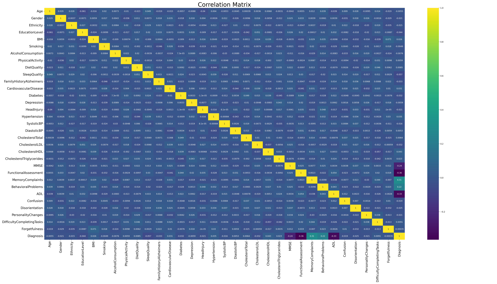

## Model Details

This binary-classification model (v0) was developed by Ian Antonio Fonseca Araújo and João Vítor de Souza Lopes (students at UFRN) and finalized on May 17, 2025. It implements logistic regression via a single-layer perceptron, trained with the Adam optimizer (learning rate 0.001).  

Input features include Activities of Daily Living (ADL), behavioral problems, functional assessment scores, MMSE results, and subjective memory complaints. All features were normalized using Z-score scaling. The complete code and documentation are available in the [GitHub repository](https://github.com/Onifin/PPGEEC2318/tree/main); for questions or issues, please open an issue there.

## Intended Use

The primary goal is educational: demonstrate perceptron behavior when predicting Alzheimer’s disease from cognitive and functional assessments.  
Intended users: Students and researchers exploring machine-learning methods in healthcare.  

## Factors

Model evaluation used a synthetic dataset balanced across key demographic attributes such as age and gender. While the data included a variety of features, the most influential predictors of Alzheimer’s disease remained the previously mentioned clinical and functional assessments:  
- Activities of Daily Living (ADL)  
- Behavioral problems  
- Functional assessment scores  
- MMSE (Mini-Mental State Examination)  
- Subjective memory complaints  

## Metrics

Performance was measured using:  
- **Accuracy:** proportion of correct predictions.  
- **F1-score:** harmonic mean of precision and recall.  

A sigmoid activation with a decision threshold at 0.5 was used (≥ 0.5 → Alzheimer’s positive). No further threshold tuning, subgroup analyses, or robustness checks have been conducted in this release. 

## Evaluation Data

**Datasets**  

The data obtained is available on Kaggle, and can be accessed through the following link: https://www.kaggle.com/datasets/rabieelkharoua/alzheimers-disease-dataset. The dataset contains information on 2,149 patients, which includes demographic details, lifestyle factors, medical history, clinical measures, cognitive and functional assessments, symptoms, Alzheimer's diagnosis, etc. This dataset is synthetic and was generated for educational purposes by Rabie El Kharoua.

**Motivation**  
By using a fully synthetic and balanced dataset, we ensured that class imbalances and demographic skews would not interfere with our evaluation. This approach allowed us to focus on how well the perceptron learns the pattern in the data.

**Preprocessing**  
- **Data completeness:** no missing or implausible values were present, so no imputation or record removal was necessary.  
- **Feature handling:** only numeric attributes proved relevant; binary features were included and normalized without information loss.  
- **Normalization:** all continuous inputs (ADL, behavioral problems, functional assessment, MMSE, memory complaints) were scaled via Z-score transformation.  
- **Train/validation split:** after preprocessing, 80 % of the cleaned dataset was used for training and 20 % reserved for validation.  

## Training Data

The set has 35 columns, 33 of which are attributes, such as those mentioned above, and another 2 for ID and diagnosis result (individual at risk for Alzheimer's disease or not). After an exploratory analysis of the data using pandas profiling, it was found that only 5 attributes are correlated with the diagnosis of the disease, corresponding to a matrix of 2149 x 5 (2149 patients, with 5 relevant attributes). Additional processes for data processing were not necessary. All important attributes for training and validating the model are numeric and did not require balancing. For training, 80% of the data was used for training.

## Quantitative Analyses

The top five correlations reveal a linear relationships with the diagnosis (positive or negative).

The close proximity between the training and validation curves, and the fact that both have converged stably, indicate **good fit** and **absence of overfitting**.

We observe that, despite the model not exhibitings overfitting, its performance did not improve further as the number of epochs increased, indicating a local minimum of the loss function.

The count-based matrix shows the absolute numbers of true positives/negatives and false positives/negatives.
 

The percentage-based matrix makes it easier to compare performance across classes, showing, for example, whether the model has lower sensitivity (recall) for positives or better specificity for negatives.

**Model Performance Metrics**

- **Loss:** 0.3741  
- **Validation Loss:** 0.3733  
- **Validation Accuracy:** 0.8605  
- **Validation F1 Score:** 0.7902 

 **Note:** High-resolution figures are also available in PDF format in the images folder for better quality.  

## Ethical Considerations

All data were provided by Rabie El Kharoua. (2024). 🧠 Alzheimer's Disease Dataset 🧠 [Data set]. Kaggle. https://doi.org/10.34740/KAGGLE/DSV/8668279. 

Furthermore, it was reported that these are of synthetic origin and do not correspond to information from real people.

## Caveats and Recommendations

Although the classifier proved to be satisfactory, the low complexity of the model prevented better results. One possibility would be to build an architecture with more layers of more neurons. Possibly, regularization strategies could optimize performance even further.

Other attributes could be tested, in order to verify which new attributes could also be used for training the model.